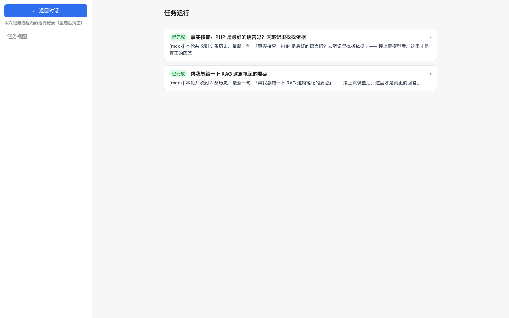
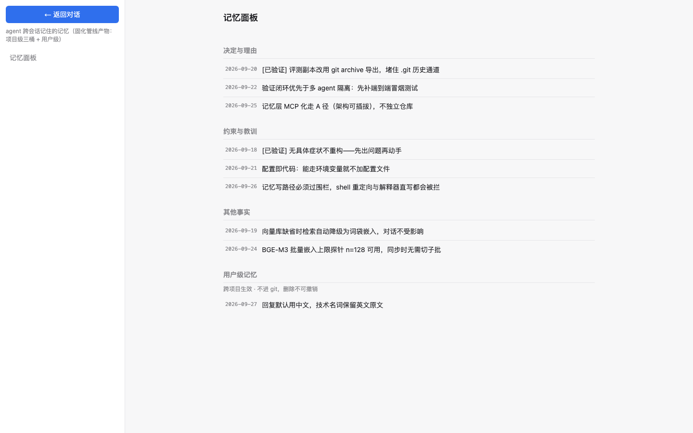
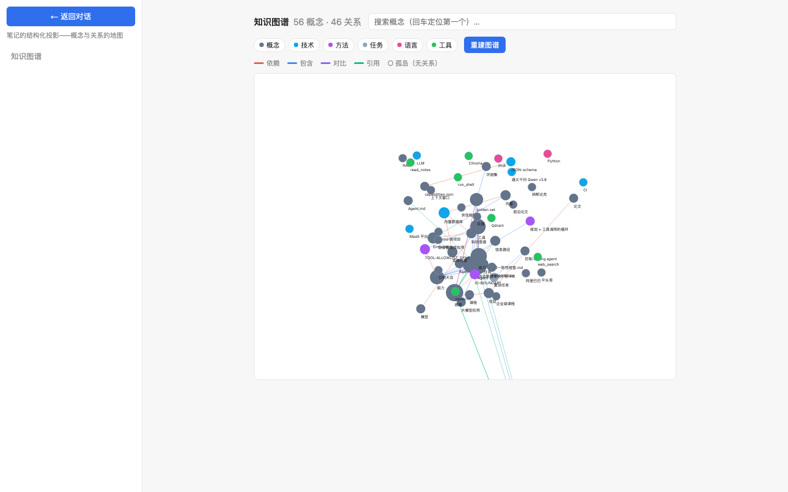
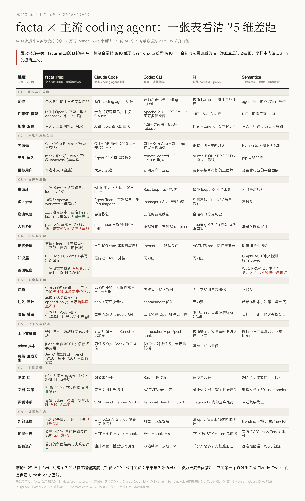

# Facta · 个人 AI Agent / Personal AI Agent

[](https://github.com/Wenyan0315/facta/actions/workflows/ci.yml)
[](https://www.python.org/)
[](LICENSE)

**从零自研的个人 AI Agent：执行主轴 + 长期记忆 + 工具/MCP 通用外延。无 Agent 框架，分层全部手写，接口与实现分离、逐层可替换。**

**A personal AI agent built from scratch — execution-first, with durable memory, extensible via built-in tools and MCP. No agent framework: every layer is hand-written, interface/implementation separated, and individually replaceable.**


> 完整架构说明（中文）：[docs/architecture.md](docs/architecture.md)｜97 份决策记录见 [docs/decisions/](docs/decisions/)。
> Full architecture docs are in Chinese; 97 decision records live in [docs/decisions/](docs/decisions/).

---

## 界面一览 / UI Tour

以下为 Web 壳的四个面板，截自 mock 模式（`FACTA_PROVIDER=mock`），图中全部为演示数据：
The four web panels below were captured in mock mode (`FACTA_PROVIDER=mock`); everything shown is demo data.

| 对话 / Chat | 任务视图 / Tasks |
|---|---|
|  |  |

| 记忆面板 / Memory | 知识图谱 / Knowledge graph |
|---|---|
|  |  |

---

## 特性 / Features

- **ReAct 主循环 / ReAct loop**：感知 → 决策 ⇄ 工具调用 → 观察；模型掌握决策权，程序掌握执行权。<br>
  Perceive → decide ⇄ call tools → observe; the model owns decisions, the program owns execution.
- **九族内置工具 / Nine built-in tool families**：time / history / notes / files / terminal / web / todo / plan+spawn / graph；另有 stdio + HTTP 双传输的 MCP 客户端。<br>
  time / history / notes / files / terminal / web / todo / plan+spawn / graph; plus an MCP client over both stdio and HTTP transports.
- **Plan-then-act 人审掌舵 / Plan-then-act with human steering**：复杂任务先出计划等人批准，步骤派发自动回写，终态收官校验。<br>
  Complex tasks start with a plan awaiting approval; dispatched steps write back automatically, and final states are verified at close-out.
- **场景路由 / Scenario routing**：轮首一针按 direct / single_tool / complex 决定工具菜单形状（可插拔，缺席走原生路径）。<br>
  One classifier call per turn (direct / single_tool / complex) shapes the tool menu (pluggable; absent → native path).
- **多层记忆 / Layered memory**：会话内消息、滚动摘要（底片不动）、跨会话多会话、`data/learned` 三桶固化管线（萃取 → 枚举审查 → 硬校验）、用户级记忆外置。<br>
  In-session messages, rolling summaries (originals never mutated), cross-session recall, a three-bucket consolidation pipeline for `data/learned` (extract → enumerated review → hard validation), and externalized user-level memory.
- **RAG 知识层 / RAG knowledge layer**：BGE-M3 向量嵌入 + ChromaDB 增量向量库 + 知识图谱（抽取 / 增量同步 / 查询原语），检索带出处。<br>
  BGE-M3 embeddings + an incremental ChromaDB vector store + a knowledge graph (extraction / incremental sync / query primitives); retrieval always carries provenance.
- **LLM 网关 / LLM gateway**：OpenAI 兼容接口；记账、重试超时、双档缓存、熔断四件套 + FallbackLLM 降级链。<br>
  An OpenAI-compatible interface with metering, retry/timeout, two-tier caching, and circuit breaking, plus a FallbackLLM degradation chain.
- **崩溃恢复 / Crash recovery**：工具边界落盘账本，进程被 kill -9 后重启自动 heal，已记录的结果原样恢复；结果未知的副作用会提示模型先核验再继续。<br>
  A ledger is persisted at tool boundaries; after a kill -9 the process self-heals on restart — recorded results are restored as-is, and side effects with unknown outcomes prompt the model to verify before continuing.
- **安全收口 / Safety gates**：L0/L1 命令白名单 + L2 确认缝、外部命令三档执行隔离（`FACTA_SANDBOX`：none / workspace-write / container；后端按平台探测 seatbelt 或 bwrap，无可用后端时诚实降级不假装有围栏）× 三档确认策略（`FACTA_APPROVAL_POLICY`：untrusted / on-request / never）、记忆写入围栏、审计 append-only；当前档位与实际后端在 Web 侧栏徽章直接可见。<br>
  L0/L1 command whitelists + an L2 confirmation gate, three-tier sandboxing for external commands (`FACTA_SANDBOX`: none / workspace-write / container; seatbelt or bwrap backend detected per platform, with honest degradation when no backend is available) × three-tier approval policy (`FACTA_APPROVAL_POLICY`: untrusted / on-request / never), a memory-write fence, and append-only audit logs; the configured level and actual backend are visible on the web sidebar badge.
- **CLI + Web 双壳 / CLI + Web shells**：FastAPI + SSE 流式（仅绑 127.0.0.1），Preact 前端四个面板（对话 / 任务计划 / 记忆 / 知识图谱）。<br>
  FastAPI + SSE streaming (bound to 127.0.0.1 only), with four Preact panels: chat / task plans / memory / knowledge graph.
- **离线评估 / Offline evaluation**：冻结题库 + git archive 副本剥离 + 注入金丝雀 + LLM-as-judge，CI 中与单元测试同跑。<br>
  A frozen scenario bank + git-archive copy isolation + injection canaries + LLM-as-judge, running in CI alongside unit tests.

---

## 竞品对标 / Competitive Landscape

批判视角的 25 维对照（2026-09 口径，facta 数据来自实际读码）：明确领先的只有**工程诚实度**——公开的负面结果与失效边界；能力维度全面落后，第一个真对手不是 Claude Code，而是自己的 bash-only 基线。
A deliberately critical 25-dimension comparison (as of 2026-09; facta data from actually reading the code): the only clear lead is **engineering honesty**—published negative results and failure boundaries. On capability it lags across the board; the first real competitor isn't Claude Code, it's its own bash-only baseline.



---

## 快速开始 / Quick Start

需要 Python 3.11+。 / Requires Python 3.11+.

```bash
git clone https://github.com/Wenyan0315/facta.git
cd facta

# 安装：dev=测试与工具链，rag=向量库，web=Web 壳（按需组合）
# Install: dev=testing/tooling, rag=vector store, web=web server (combine as needed)
pip install -e ".[dev,rag,web]"

# 配置密钥（.env 已被 gitignore）/ Configure API keys (.env is gitignored)
cp .env.example .env
# 编辑 .env：填入一家 LLM 的 API_KEY 就能跑（教学模式只要 FACTA_PROVIDER=mock）
# Edit .env: one LLM API key is enough to run (teaching mode only needs FACTA_PROVIDER=mock)
```

任意 OpenAI 兼容供应商均可通过 `{前缀}_API_KEY` / `{前缀}_BASE_URL` / `{前缀}_MODEL` 三个环境变量接入。不装 `[rag]` 时自动退化为词袋嵌入，零外部服务也能跑。

Any OpenAI-compatible provider plugs in via three environment variables — `{PREFIX}_API_KEY` / `{PREFIX}_BASE_URL` / `{PREFIX}_MODEL`. Without `[rag]` installed, embeddings degrade to a bag-of-words fallback, so it runs with zero external services.

### 支持的供应商 / Providers

| `FACTA_PROVIDER` | 配置前缀 / Prefix | 默认 base_url / Default | 默认模型 / Default model | embedding 可用 / Embedding options |
|---|---|---|---|---|
| `mock` / `echo` / `repeat` | （无 key，教学 / no key, teaching） | — | — | 词袋 / bag-of-words |
| `deepseek`（默认 / default）/ `deepseek-flash` | `DEEPSEEK_` | api.deepseek.com | deepseek-chat / deepseek-flash | — |
| `siliconflow` | `SILICONFLOW_` | api.siliconflow.cn/v1 | DeepSeek-V3 | `siliconflow`（默认 / default）/ `openai` |
| `openai` | `OPENAI_` | api.openai.com/v1 | gpt-4o-mini | `openai`（设 / set `FACTA_EMBED_PROVIDER=openai`）/ `siliconflow` |
| `qwen` | `DASHSCOPE_` | dashscope.aliyuncs.com/compatible-mode/v1 | qwen-plus | `siliconflow` / `openai` |
| `zhipu` | `ZHIPU_` | open.bigmodel.cn/api/paas/v4 | glm-4-flash | `siliconflow` / `openai` |
| `moonshot` | `MOONSHOT_` | api.moonshot.cn/v1 | moonshot-v1-8k | `siliconflow` / `openai` |

不在表里的中转商不必改代码：用 `{PREFIX}_BASE_URL` + `{PREFIX}_MODEL` 直接覆盖默认。embedding 通过 `FACTA_EMBED_PROVIDER`（默认 `siliconflow`）切换；缺 key 或未装 `[rag]` 时自动降级词袋嵌入，对话不报错（只是检索质量变差）。详见 [ADR 070](docs/decisions/070-multi-provider-compatibility.md)。

Providers not listed need no code changes: override defaults directly with `{PREFIX}_BASE_URL` + `{PREFIX}_MODEL`. Embeddings switch via `FACTA_EMBED_PROVIDER` (default `siliconflow`); a missing key or uninstalled `[rag]` degrades to bag-of-words embeddings — chat keeps working (only retrieval quality drops). See [ADR 070](docs/decisions/070-multi-provider-compatibility.md).

### 可选能力 / Optional capabilities

这两件不配置也能跑，配了多两块能力（`.env.example` 里都有现成注释行）：

- **联网搜索 / Web search**：填 `TAVILY_API_KEY`（或 `BOCHA_API_KEY`，博查优先）。不填则 `web_search`/`fetch_web` 自动不上工具菜单，其余功能不受影响。
  Set `TAVILY_API_KEY` (or `BOCHA_API_KEY`, which takes precedence). Without it the `web_search`/`fetch_web` tools simply stay off the menu — everything else works.
- **场景路由 / Scenario routing (M10)**：填 `JEV_API_KEY`（可选 `JEV_BASE_URL`）。轮首由 Jev 按 direct / single_tool / complex 决定工具菜单形状；不填走原生全菜单路径，mock 模式自动跳过。
  Set `JEV_API_KEY` (optional `JEV_BASE_URL`) for per-turn direct / single_tool / complex routing; without it the agent uses the native full-menu path (skipped automatically in mock mode).

### CLI

```bash
python -m facta          # 真模型（默认 deepseek-flash）/ real model (default deepseek-flash)
python -m facta mock     # 假模型：不花钱、不联网，适合体验流程 / mock model: free & offline, good for a first tour
```

### Web

```bash
python -m facta.server   # http://127.0.0.1:8000（只绑 loopback，默认 deepseek / loopback only, default deepseek）
```

> **默认模型差异 / Default model differs by entry point**（ADR 069 P2-8）：CLI 默认 `deepseek-flash`（便宜主力 / cheap workhorse），Web 默认 `deepseek`（chat 档 / chat tier）。任一处都可用 `.env` 里的 `FACTA_PROVIDER=<name>` 覆盖。详见 [支持的供应商](#支持的供应商--providers)。<br>
> Either entry point can be overridden with `FACTA_PROVIDER=<name>` in `.env`. See [Providers](#支持的供应商--providers).

### 测试 / Tests

```bash
pytest                  # 700+ 用例 / 700+ tests
ruff check && mypy src/facta
```

---

## 项目结构 / Layout

```
src/facta/
├── orchestrator/   # 编排层：run_turn 主循环、Agent 对象、依赖装配、崩溃账本 / orchestration: run_turn loop, Agent, DI assembly, crash ledger
├── tools/          # 工具层：ToolRegistry + 九族工具 + MCP 客户端 + 沙箱 / tools: ToolRegistry + nine families + MCP client + sandbox
├── core/           # 地基层：LLM 接口、网关四件套、场景路由、evalkit / core: LLM interface, gateway suite, scenario routing, evalkit
├── knowledge/      # 知识层：RAG 检索、向量库、知识图谱 / knowledge: RAG retrieval, vector store, knowledge graph
├── memory/         # 记忆层：会话、压缩、固化三桶、计划板 / memory: sessions, compression, three-bucket consolidation, plan board
├── server/         # Web 壳（FastAPI + SSE）与前端静态资源 / web shell (FastAPI + SSE) and frontend static assets
└── github_bot/     # GitHub bot 壳：非交互 worker、任务提示词 / GitHub bot shell: non-interactive worker, task prompts
evals/              # 离线评估：冻结题库、注入题库、judge / offline evals: frozen scenarios, injection bank, judge
servers/            # MCP 演示服务器 / MCP demo servers
tests/              # pytest 测试 / pytest tests
docs/               # 架构文档与 ADR（97 份）/ architecture docs and ADRs (97)
data/               # 语料与运行时数据（notes/learned.example 入库，其余 gitignore）/ corpus & runtime data (notes + learned.example tracked; the rest gitignored)
```

装配遵循「唯一真值源」：CLI、Web 与 GitHub bot 三个壳都经 [orchestrator/assemble.py](src/facta/orchestrator/assemble.py) 依赖注入，条件装配（无 key 不挂路由、缺向量库不注册 RAG）。

Assembly follows a "single source of truth": CLI, Web and the GitHub bot all build through dependency injection in [orchestrator/assemble.py](src/facta/orchestrator/assemble.py), with conditional assembly (no key → no router; no vector store → no RAG tools).

---

## 文档导航 / Documentation

| 文档 / Doc | 内容 / Contents |
|---|---|
| [docs/architecture.md](docs/architecture.md) | 系统架构（分层图、97 份 ADR 索引、在册触发信号）/ System architecture (layered diagram, index of 97 ADRs, registered trigger signals) |
| [docs/decisions/](docs/decisions/) | 架构决策记录（ADR 001–097，含否决档案）/ Architecture decision records (ADR 001–097, incl. rejected alternatives) |
| [docs/manual-test-cases.md](docs/manual-test-cases.md) | 人工测试用例集 / Manual test cases |
| [docs/github-bot.md](docs/github-bot.md) | facta-bot 接入指南（issue 打 label 自动修、PR 自动审查的 GitHub 接入层配置手册）/ facta-bot integration guide (GitHub entry layer: label an issue to auto-fix, auto-review PRs) |

## 许可证 / License

[MIT](LICENSE)
